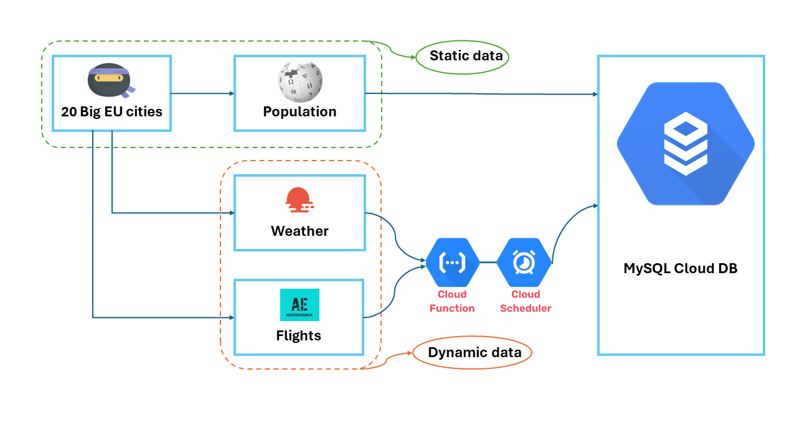
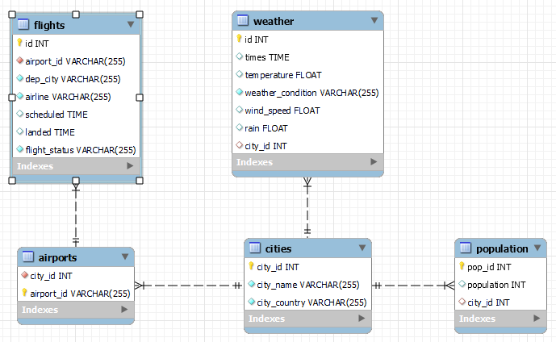

# Case study: Gans (A Data Engineering project)
## Description
Gans is a startup developing an escooter-sharing system. It aspires to operate in the most populous cities in Europe. The management at Gans believes that its operational success depends on something more mundane: **having its scooters parked where users need them.** They have asked the **data engineering team*** to gather weather and flight information from major European cities to be able to make data-driven predictions of their scooters' location.

## Project execution
The project execution will involve three major phases, including building a local pipeline and migrating it to the cloud. In the end, a fully automated data pipeline should be created that resembles the flowchart here.  

The deliverable of this project is a written blog of all that has been executed in this project equivalent to a **Medium article**

### **Phase 1: Local pipeline**
In this phase, I create a data pipeline locally, which involves collecting data from external sources, transforming it, and storing it in an SQL DB. This will provide a foundation for building a scalable and automated pipeline in the cloud.

#### Create an empty SQL DB *gans_cities* ([code here](https://github.com/sumitdeole/Data_engineering_project/blob/66e23f09cdf732cfdc8572e65cfb14791643caee/code/1.%20Gans_cities.sql))
Let's create an empty SQL DB so that we can push data collected in the next steps into it. The EER diagram of the SQL DB looks as shown here. 

#### Select major European cities: *Ninja API* ([code here](https://github.com/sumitdeole/Data_engineering_project/blob/1c4d93b96bf54f218dc3784a528a304593025897/code/2.%20select_cities_ninja_api.ipynb), [data file](https://github.com/sumitdeole/Data_engineering_project/blob/8ca9be19bb835b7ad8ad173c55fd3a66717f7a74/data/1.%20cities_df_cleaned.csv))
In the next step (code file #3) will undertake web scraping to extract population and geographical data on selected countries. While it suffices to pick cities of our choice, I will take an automatized approach to city selection. The following two steps are undertaken:
1. I select a list of countries where Gans is present. ``countries=["DE", "FR", "IT", "PL", "PT", "ES", "GB", "CH", "NL", "BE"]``
2. Then I use Ninja API to pick large cities in these countries with populations of more than 1,000,000.
A resultant data frame with 20 cities is constructed. 
#### Web scraping using *BeautifulSoup* ([code 1 here](https://github.com/sumitdeole/Data_engineering_project/blob/1c4d93b96bf54f218dc3784a528a304593025897/code/3.%20webscraping_beautifulsoup.ipynb), [data file 1](https://github.com/sumitdeole/Data_engineering_project/blob/8ca9be19bb835b7ad8ad173c55fd3a66717f7a74/data/2.%20df_cities_ws_cleaned.csv), [code 2 here](https://github.com/sumitdeole/Data_engineering_project/blob/1c4d93b96bf54f218dc3784a528a304593025897/code/4.%20SQL_integration_sqlalchemy.ipynb), [data file 2](https://github.com/sumitdeole/Data_engineering_project/blob/8ca9be19bb835b7ad8ad173c55fd3a66717f7a74/data/3.%20df_sql_city_id.csv))
Now, I will web-scrape wiki pages to obtain information on the following three columns:
- population
- average elevation (in m)
- country

Afterward, I will push the resultant data to the *SQL DB* created above. In particular, I will perform the following steps:
- Establish a connection link with the SQL DB in MySQL workbench
- Move the cities data frame (columns: "City" and "Elevation") to SQL DB uniquely identifying the city names (table column "city_id") - **SQL Table cities**
- Read the SQL table in Python and merge city_id back into the web-scraped data frame
- Move data to the following SQL tables:
    1. Countries (with columns: "city_id", "Country", "country_2c") - **SQL Table *countries***
    2. Populations (with columns: "city_id", "Population") - **SQL Table *populations***
    3. Coordinates (with columns: "city_id", "latitude", "longitude") - **SQL Table *coordinates***
#### Weather data collection using the *OpenWeather API* ([code here](https://github.com/sumitdeole/Data_engineering_project/blob/1c4d93b96bf54f218dc3784a528a304593025897/code/5.%20weather_data_OW_api.ipynb), [data file](https://github.com/sumitdeole/Data_engineering_project/blob/8ca9be19bb835b7ad8ad173c55fd3a66717f7a74/data/4.%20df_city_id_weather.csv))
Now I will collect weather forecast data for the selected cities from the OpenWeather API ([API Documentation](https://openweathermap.org/forecast5)). The API allows us free access to **5 Day / 3 Hour Forecast**: a 5-day forecast data with a 3-hour step. 
Relevant to the Gans use case, I will collect information on the following:
- *'Temp'* - Average temperature
- *'Feels_like'* - Avg. temp felt.
- *'Sunrise'* - Datetime for the sunrise
- *'Sunset'* - Datetime for the sunset
- *'Weather'* - Overall description of the weather (Rain, Snow, Clouds etc.)
- *'Snow'* - Avg. snow
- *'Rain'* - Avg. rain
- *'Wind'* -  Avg. wind speed

This information will be pushed to **SQL Table *weather***
#### Flights data collection using the *AeroDataBox API* ([code here](https://github.com/sumitdeole/Data_engineering_project/blob/1c4d93b96bf54f218dc3784a528a304593025897/code/6.%20flights_data_aerodatabox_api.ipynb), [data file 1](https://github.com/sumitdeole/Data_engineering_project/blob/8ca9be19bb835b7ad8ad173c55fd3a66717f7a74/data/5.%20df_airports_merged.csv), [data file 2](https://github.com/sumitdeole/Data_engineering_project/blob/8ca9be19bb835b7ad8ad173c55fd3a66717f7a74/data/6.%20df_flight_arrivals.csv))
Gans wants to know when the flights arrive in the city of interest to be able to predict the escooter usage. To obtain flight arrival times for the day of interest, I use the AeroDataBox API ([API Documentation](https://rapidapi.com/aedbx-aedbx/api/aerodatabox/details)). This code will generate two SQL tables:

1. **Airports ICAO codes**: A function *icao_airport_codes(latitudes, longitudes)* will take in city coordinates and find airports closer to the selected cities. Importantly, it will store city ICAO codes that will be used to obtain the flight data. This information will be pushed to **SQL Table *airports***  
2. **Flights data**: A function *get_arrival_data(icao_list)* will take in airport ICAO codes and produce the following flight data columns. Notably, the flight data for the next day will be produced to be able to forecast escooter traffic. This information will be pushed to **SQL Table *flights***
      - *"arrival_airport_icao"* - Arrival airport's ICAO code
      - *"departure_airport_icao"* - Departure airport's ICAO code
      - *"departure_airport_name"* - Departure airport's name
      - *"scheduled_arrival_time"* - Scheduled arrival time
      - *"flight_number"* - Flight number
      - *"data_retrieved_at"* - Date of the data retrieval
  

### **Phase 2: Cloud Pipeline**
#### GCP MySQL
#### Cloud Functions
#### Cloud Scheduler

### **Phase 3: Write a medium article**
The deliverable of this project is a written blog of all that has been executed in this project equivalent to a **Medium article**
